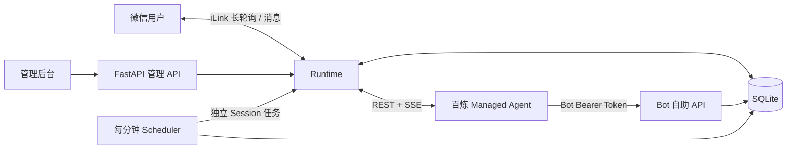

# 架构与实现地图

## 进程与数据边界

一个 FastAPI 进程承载管理接口、Bot 接口、微信接收、聊天执行、定时任务扫描及执行。SQLite 使用 WAL。没有 Redis、Celery、外部消息队列或前端构建服务。**不能启用多个 Uvicorn worker。**

## 文件职责

| 路径 | 职责 |
| --- | --- |
| app/main.py | 生命周期、管理员认证、管理 API、静态资源、绑定公开票据 |
| app/bot_api.py | Bot Token 鉴权、自身用量、新会话请求、定时任务 CRUD |
| app/runtime.py | 每 Bot 锁、微信收发、上传审核、MA 执行/SSE、审批与中断、恢复状态机 |
| app/ma.py | MA REST/SSE 客户端、事件标准化、轮次边界、mark_artifacts、微信通用提示词 |
| app/store.py | SQLite 表、增量迁移、消息去重、会话切换事务、Token 持久化 |
| app/billing.py | 金额精度、费率快照、Session 用量差值、工具调用去重与原子扣费 |
| app/schedules.py | 时间规则、时区、下次触发计算、分钟扫描与事务领取 |
| app/media.py / replies.py | 媒体下载/加解密/上传与文本消息切分 |
| static/ | 无构建步骤的 HTML/CSS/JavaScript 管理界面 |
| skills/claw-bot-self-service/ | 云端 Agent 使用的 Skill 和标准库客户端脚本 |
| tests/ | 临时 SQLite、假微信/MA 接口下的协议、状态机与权限测试 |

## 主要数据表

| 表 | 保存内容 |
| --- | --- |
| bots | 微信登录信息、当前聊天 Session、Memory Store、Bot Token、预算和归档标记 |
| bindings | 二维码、随机分享票据、有效期和绑定状态 |
| jobs | 微信或定时执行记录、用户事件锚点、附件、回复进度、计费快照、schedule_id |
| bot_sessions | 当前及历史 Session，source=scheduled 表示定时会话 |
| agent_prices | 每 Agent 的费率与缓存模式 |
| session_billing | 每个 Session 上次结算用量 |
| job_tool_calls | 按 workspace/session/call_id 去重的 web_search 调用 |
| charges | 关联 job_id 的唯一扣费明细、用量差值、单价与费用分项 |
| bot_reset_requests | 幂等的新会话请求及异步处理状态 |
| schedules | 用户身份、时间规则、下次执行时间和软删除状态 |

本地数据库包含敏感数据，不只是缓存；云端资源由百炼管理。本地删除或暂停并不自动删除或取消云端资源。

## 一条聊天消息的路径

1. 微信长轮询返回消息和 cursor；消息按 `(bot_id,message_id)` 去重，入库与 cursor 推进一起提交。
2. `/usage` 是本地查询；`/clear` 是本地控制命令。普通请求进入 queued；附件依次下载解密、上传 MA、等待审核、挂载 Session。
3. 检查预算、锁定费率和用量基线，预建 SSE，再 POST user message。提交前持久化状态，避免进程崩溃后盲目重发。
4. 使用服务器返回的用户事件 ID 划分本轮。SSE 获取完整事件，重连/定期从历史接口校验。只发送主 Agent 的 assistant message，工具事件不回传。
5. 成功 mark_artifacts 的文件形成独立交付队列，完成后按原始格式发送图片或文件。
6. 任务终态后读取 Session 累计用量，以差值结算；扣费、账单、用量 checkpoint 和任务状态一起提交。

新聊天消息到达时，旧聊天轮次先发送 user interrupt、等待远端 idle，再开始下一条。文本/附件发送响应丢失时保留不确定状态，不能把网络超时等同于“远端没收到”。

## 独立定时执行

扫描器每 60 秒查到期任务，事务比较旧 next_run_at 后推进时间并创建 job；同一触发不会因重复扫描而重复入队。多个漏掉的周期合并补一次；上一轮未结束则记录跳过。

定时 worker 与聊天 worker 使用同一 Bot 锁协调数据库/预算，但使用独立 Session、事件缓冲和回复进度。它不会修改 `bots.session_id`，也不会被聊天的新消息中断。每次运行沿用该 Bot 的身份、Memory Store 和入队时选定的 Agent/环境，结束后统一微信回传。删除任务停止后续触发，已开始的执行继续完成。

## 自助新会话请求

Agent 在执行中调用 reset API 时，接口先返回 queued。待聊天轮次结束、回传和结算后，后台创建新 Session。Idempotency-Key 和 expected_session_id 防止重复/过时操作；创建结果丢失时查询 metadata 恢复，不重复创建。会话历史、当前映射及操作完成状态原子提交。

## 关键不变量

- Bot Bearer Token 只能访问所属 Bot；管理员 cookie 不等价于 Bot 身份。
- Token 注入 Session，不能写入共享 Agent system、Skill 包或前端列表。
- 不把整个 Session 用量重复算给每一轮，不把缓存 Token 重复收费。
- `charges.job_id` 唯一；工具调用按远端 call_id 去重，SSE 重放不重复收费。
- 定时 Session 不覆盖聊天 Session；记忆是每 Bot 独立的 MA Memory Store。
- 创建/提交/回传超时不等于失败，恢复操作必须考虑外部副作用已发生。
- 新增数据库字段需兼容旧库，不能在启动时重置用户数据。

## 修改入口

增加接口先看 main.py / bot_api.py；修改结算看 billing.py 及 test_billing.py；修改调度看 schedules.py、Runtime.scheduled_step 和 test_schedules.py；修改文件交付看 media.py、marked_artifacts 和 test_artifacts.py。修改通用提示词时同步 docs/agent-system-prompt.txt，但不要未经请求修改远端 Agent。
