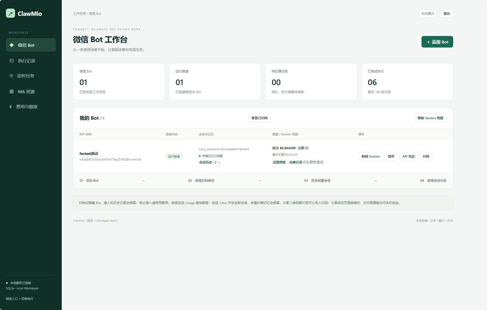
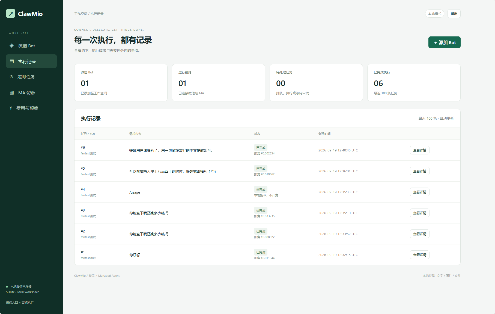
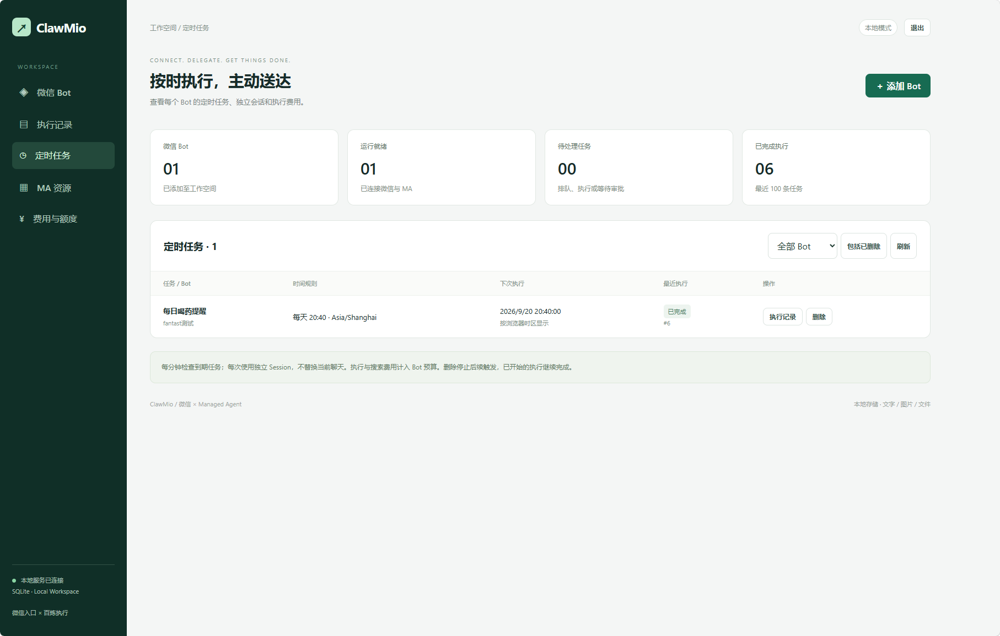
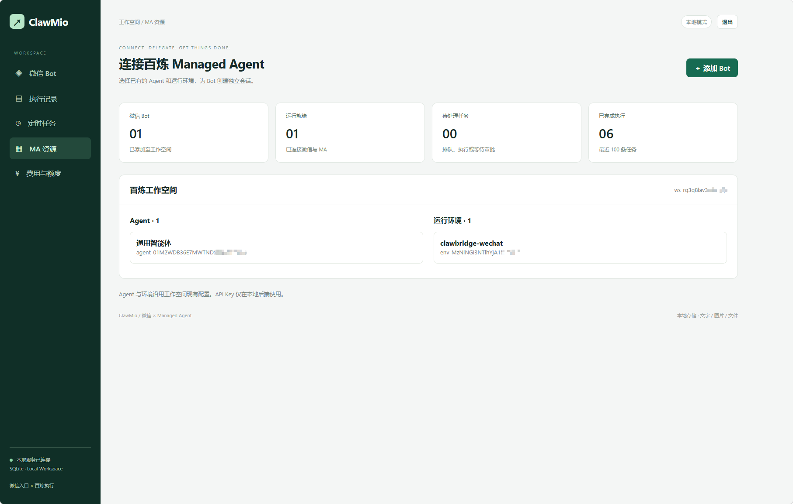
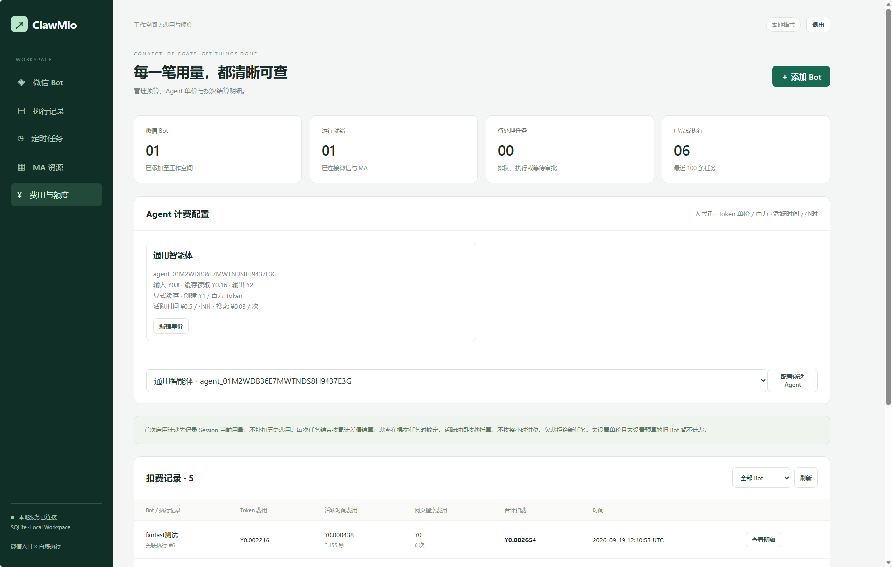
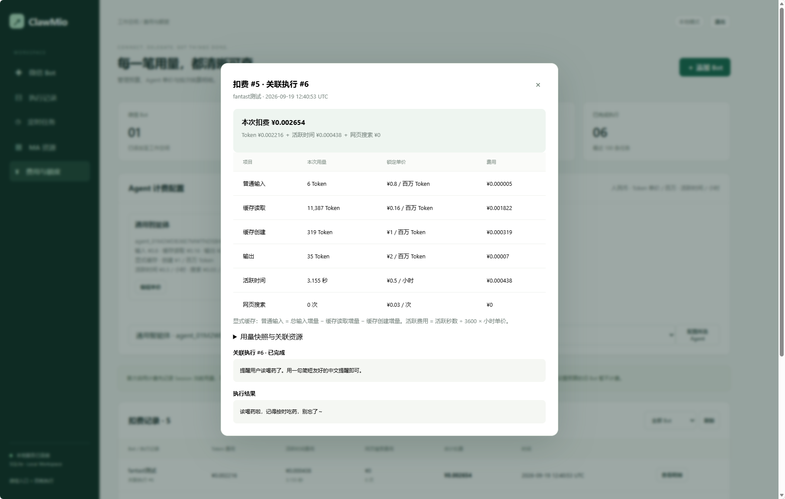
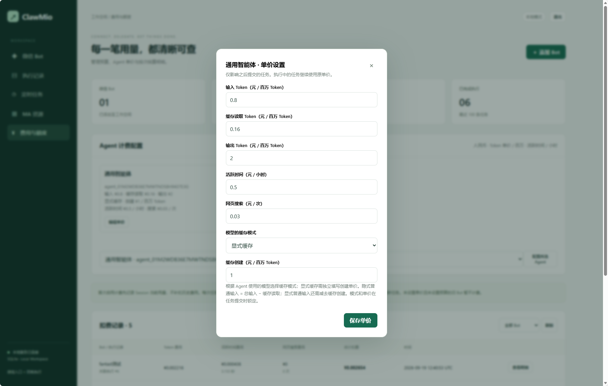

# ClawMio 效果预览

[← 返回 README](../README.md) · [安装与启动](../README.md#快速开始) · [CLI 使用指南](cli.md)

从 Bot 接入到任务执行，再到用量结算，下面展示 ClawMio 管理后台的主要页面。点击截图可查看原图。

| 页面 | 可以看到什么 |
| --- | --- |
| [微信 Bot 工作台](#bot-workspace) | 连接状态、专属记忆、会话历史与剩余额度 |
| [执行记录](#execution-history) | 请求内容、执行状态、扣费与任务详情入口 |
| [定时任务](#scheduled-tasks) | 时间规则、下次执行时间与最近执行结果 |
| [MA 资源](#ma-resources) | 百炼工作空间中的 Agent 和运行环境 |
| [费用与额度](#billing) | Agent 单价配置、扣费记录和逐项费用明细 |

## 微信 Bot 工作台

集中查看 Bot 是否就绪、专属记忆是否挂载，以及当前会话与剩余额度。新建 Session、暂停、查看 API 凭证和归档等操作集中在同一行。

## 执行记录

按任务查看用户请求、执行状态和扣费情况。普通对话、用量查询和定时提醒都可以在这里追踪，并进入详情核对结果。

## 定时任务

查看每个 Bot 的任务规则、下次执行时间和最近执行状态，可筛选 Bot、查看执行记录或删除任务。定时执行使用独立 Session，不替换当前聊天会话。

## MA 资源

在一个页面核对当前百炼工作空间、Agent 和运行环境，确认后台已经连接到预期资源。

## 费用与额度

配置 Agent 的 Token、缓存、活跃时间和网页搜索单价，按 Bot 查看每次执行的扣费记录。截图中的费率和金额是该实例的配置与记录，不代表百炼官方报价。

<strong>展开查看：单次扣费明细</strong>

逐项展示本次用量、锁定单价和费用，并关联原始任务与执行结果，方便核对一笔费用的来源。

<strong>展开查看：Agent 单价设置</strong>

分别设置输入、输出、缓存、活跃时间和搜索价格，并选择缓存模式。新价格仅影响之后提交的任务，执行中的任务继续使用已锁定的单价。

---

想自己体验？从 [安装与启动](../README.md#快速开始) 开始，或查看 [完整 CLI 命令](cli.md)。
